# Problem Set - Intro to Relational Databases

## Directions
For this problem set, you will be working with the [Pagila](https://github.com/devrimgunduz/pagila) database. 

### Preparations
1. First make sure you postgres database is up and running. 
  - On Mac, search for the postgres application (Press Command + Space for search bar) and run it. 
  - On windows, open up your Ubuntu terminal, and type in `sudo service postgresql status`. If your database is not running, you can start it with the command `sudo service postgresql start`
2. Clone down the [Pagila](https://github.com/devrimgunduz/pagila) repo to your local computer: `git clone https://github.com/devrimgunduz/pagila.git`

### Database Set Up
1. Open up TablePlus and click "Create a new connection" 
2. Select Postgres from the subsequent menu.
3. You should know see another pop up box asking for credentials. 
  - If you are on windows, add the new user and password you created during setup and click test
  - If you are on a mac, fill in the user as `postgres` and click test
4. You should see all the fields light up green. If you do, go ahead and click connect. 
5. After clicking connect, click on the SQL button on the top row 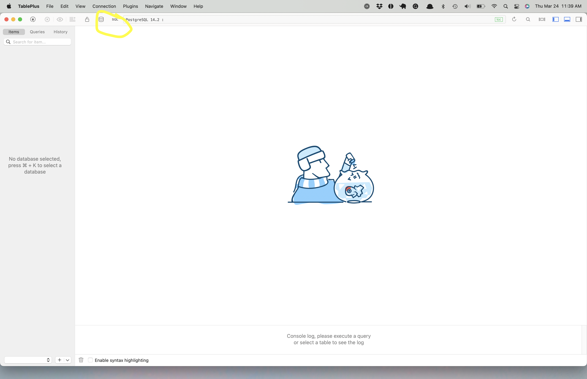
6. We will now create our database in the SQL editor. Type in `CREATE DATABASE pagila;` and click the "Run Current" button 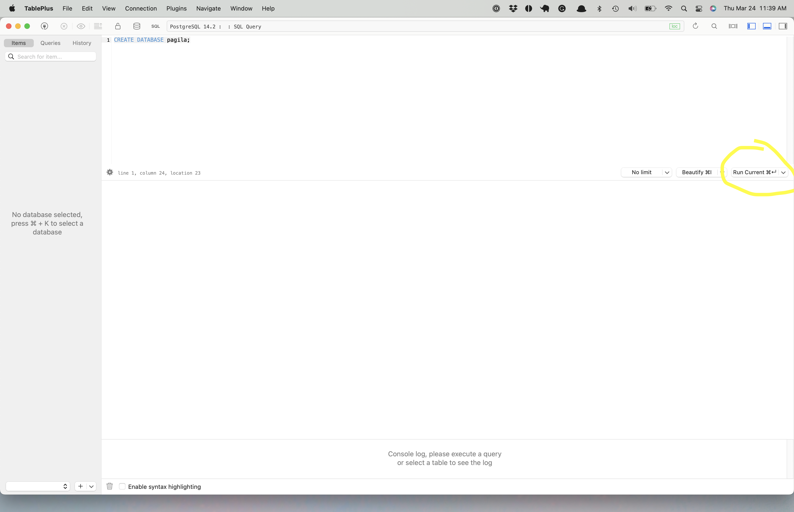
7. At the bottom you should know see "Query 1 OK: CREATE DATABASE" 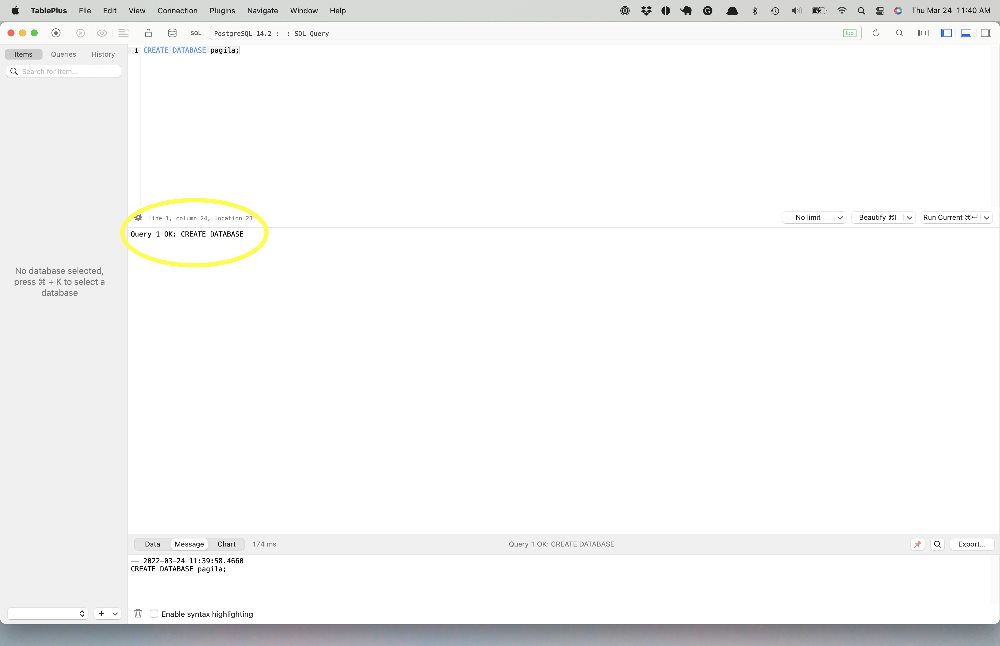
8. Click the database icon. You should be able to see the new database you just created. Click open to select that database. 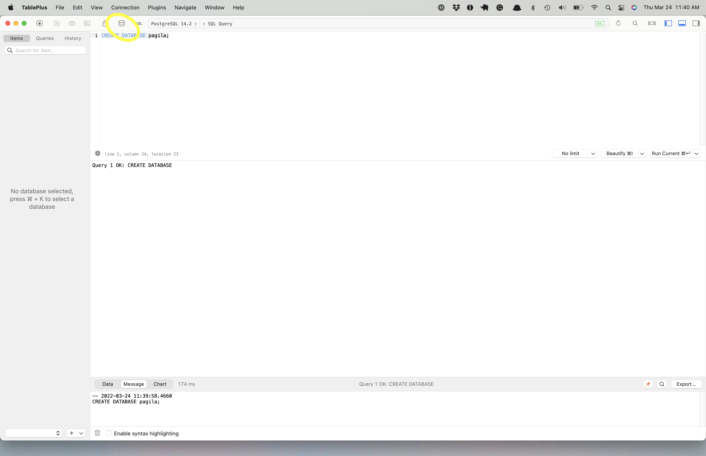 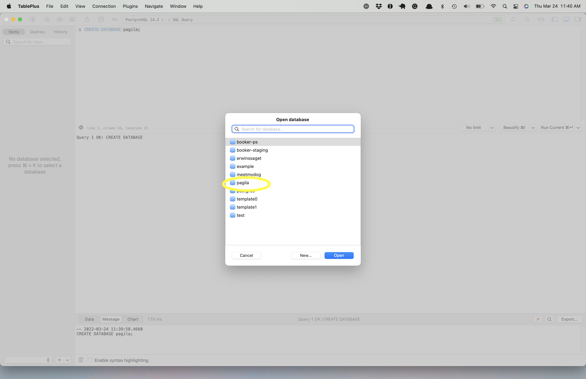
9. Now we're going to import data into our datbase. Navigate to File > Import > From SQL Dump 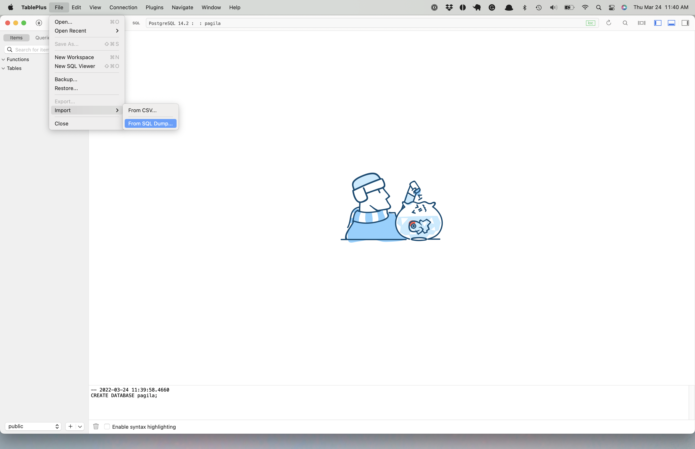
10. In the Finder/Explorer Window that comes up navigate to the directory where you cloned the pagila repo, select the `pagila-insert-data.sql` file, and click open. 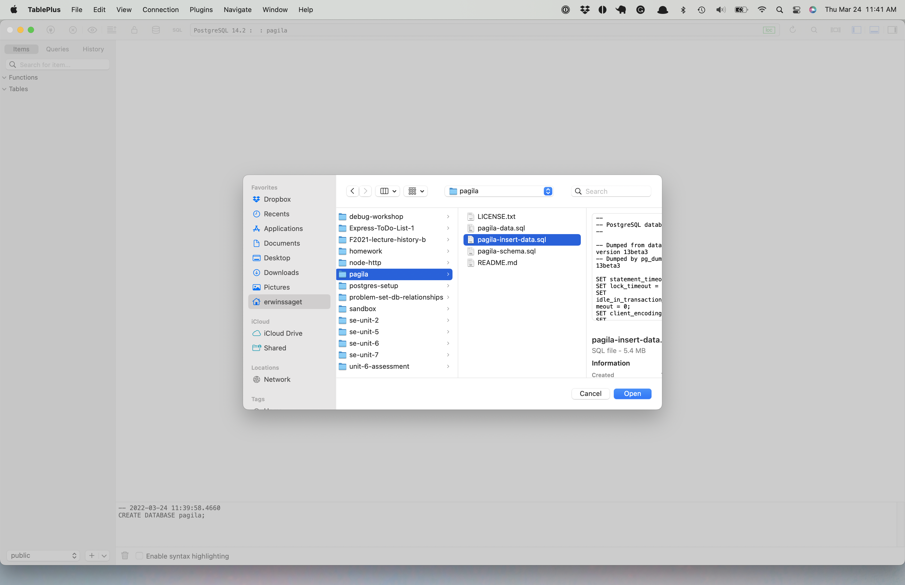
11. Click the import button. It may take a minute or so to completely import. Be patient! 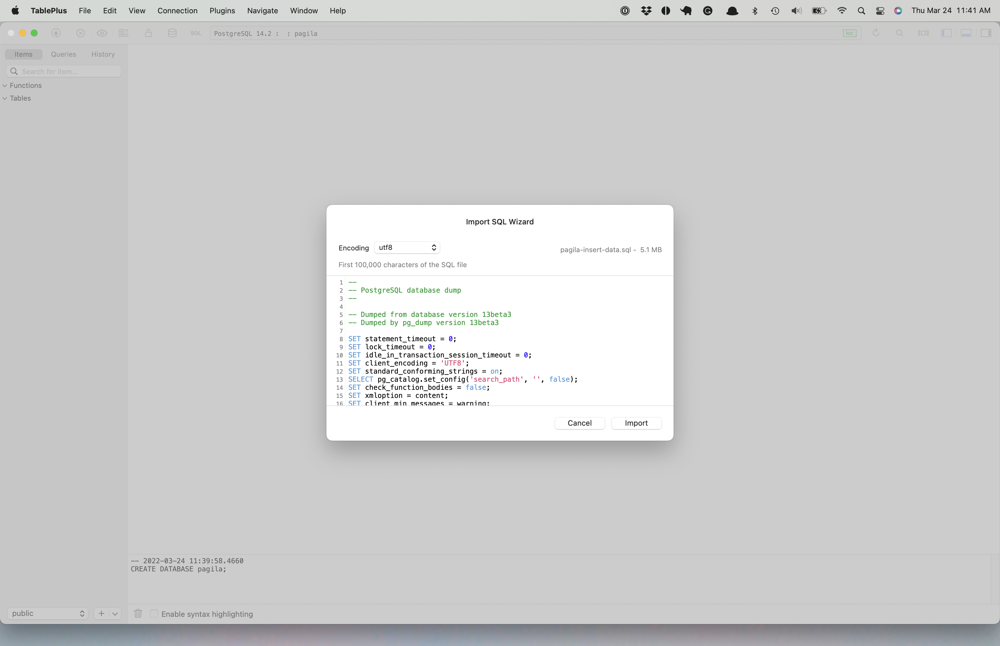
12. Once it's done, you'll see a green success toast on the right side of the screen 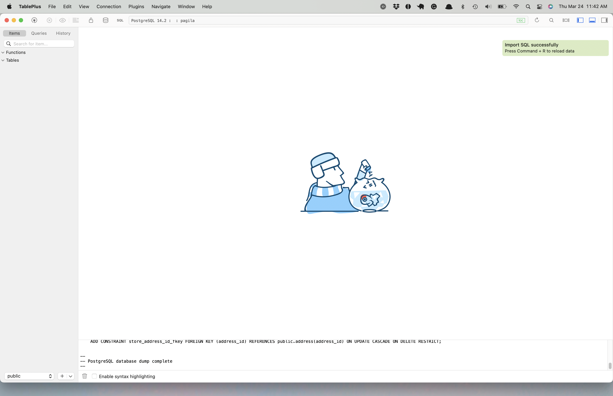
13. Once you refresh your page, you should be able to see the tables on the left side. The command to refresh will differ depending on your OS, but it should either be `Ctrl + R` or `Command + R`.
14. To ensure that everything worked properly, head back to your sql editor and make the query `SELECT * FROM public.actor;`. You should be able to see the result below. 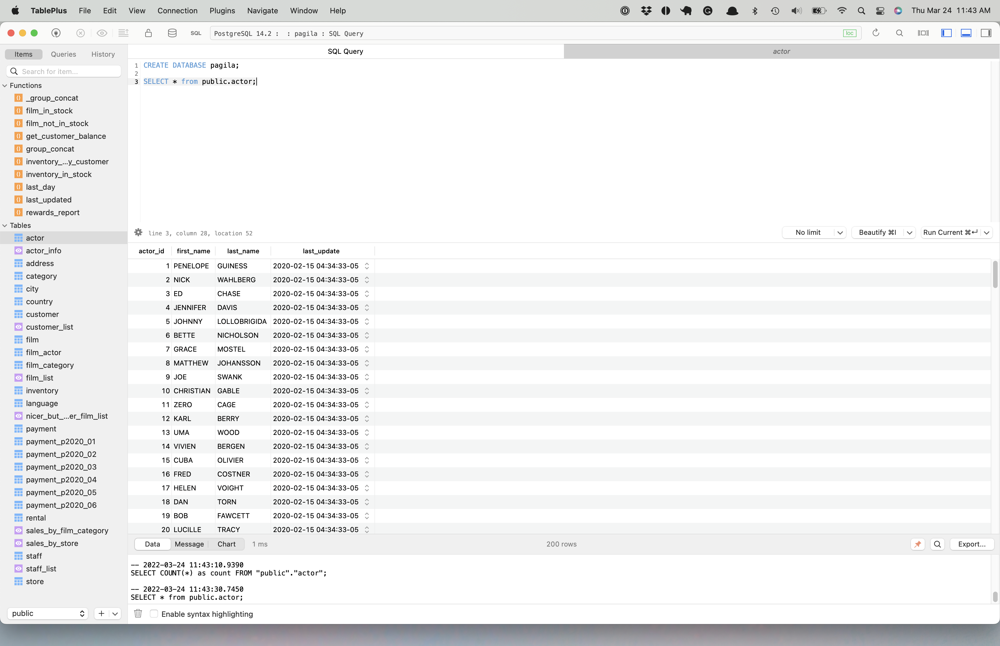

## Part I: SQL Challenge Short Reponse
In `solutions.md`, write your solutions to the questions below. Also, include the SQL queries (formatted nicely, using a multi-line code snippet) that you used to obtain your answer.

1. What total # of films have a rental rate of $0.99?
2. What is the breakdown of all films by rating? (Format this answer as a [table](https://github.com/adam-p/markdown-here/wiki/Markdown-Cheatsheet#tables) in Markdown)
3. Which actor appeared in the most films?
4. Which customer has the most movie rentals?
5. What was the longest rental period? (Hint: See `rental.rental_date` and `rental.return_date`)
6. What is the address of the store with the most films in their inventory?
7. Which category has the most films? How many films are in that category?
8. What is the address of the customer "Margaret Moore"? (Just the street address. Not the district, city, and ZIP code)
9. There is a customer with the email "CARMEN.OWENS@sakilacustomer.org". What is the name of the city that they live in?
10. What country is Store #2 (`store_id = 2`) located in?
11. What is the total replacement cost of each store's entire inventory? (**Hint**: Each store has multiple copies of many films that each have a replacement cost.)

## Part II: Entity Relationship Diagram
Create an Entity Relationship Diagram using [draw.io](https://draw.io). Include the following entities in your diagram.
* film
* actor
* category
* language
* inventory
* rental
* staff
* store
* customer

Include your ERD as a link in your `solutions.md` file. You can get a link to your _draw.io_ diagram by clicking on _File_ -> _Publish_ -> _Link..._

#### Note
There are some Many-to-Many relationships in here. Be sure to include the cross reference tables that mediate these relationships. For example, there is a M:M relationship between `film`s and `actor`s. This relationship is mediated by the `film_actor` table. Be sure to include that in your ERD as well.

Lastly, for your entities, you do not have to list the data types next to your attributes (column). Simply place an asterisks next to the primary key of the entity. See below:
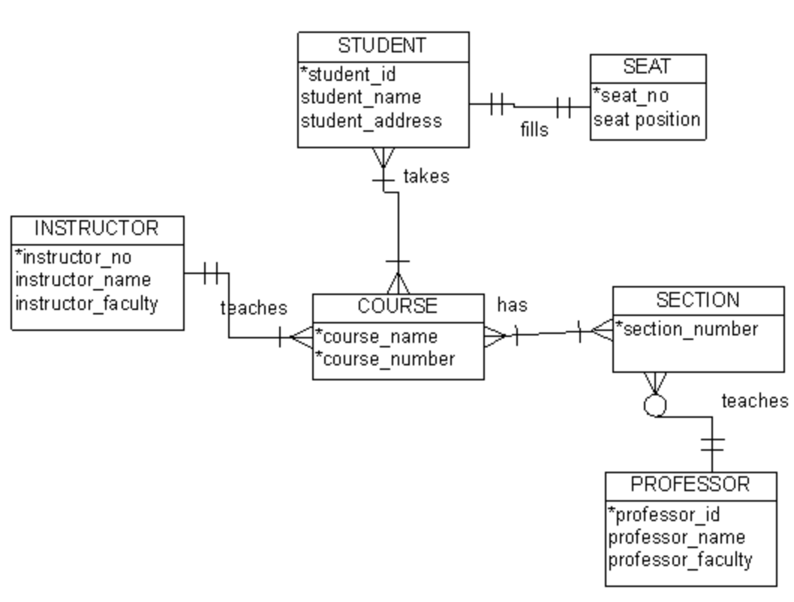

