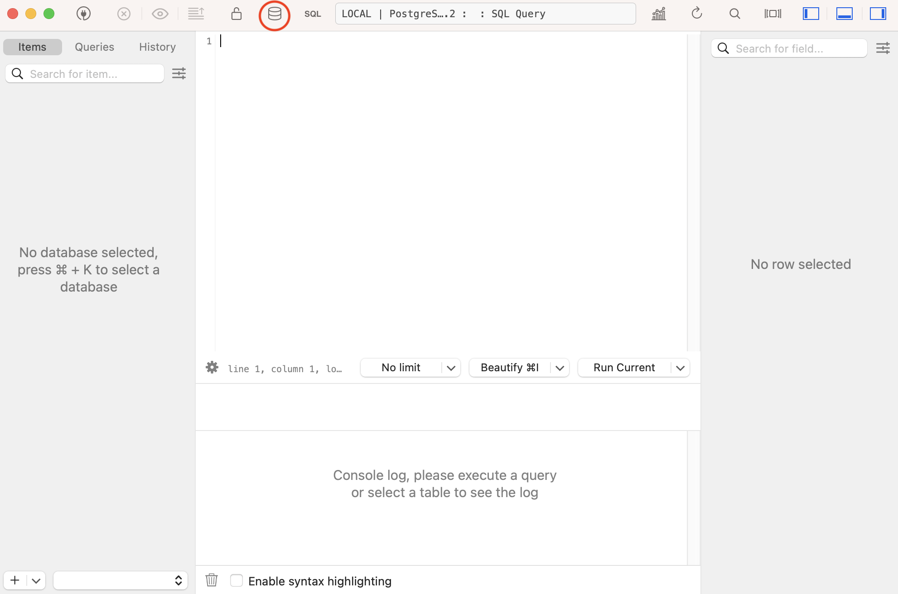
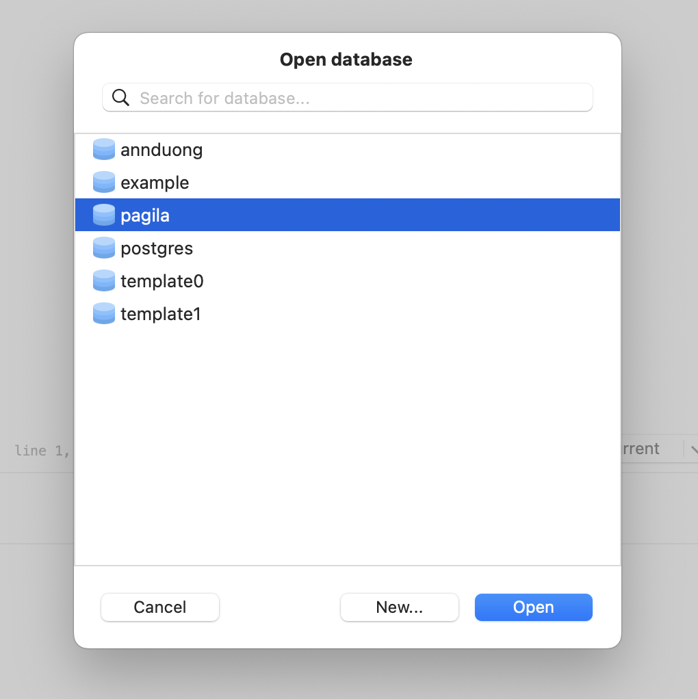
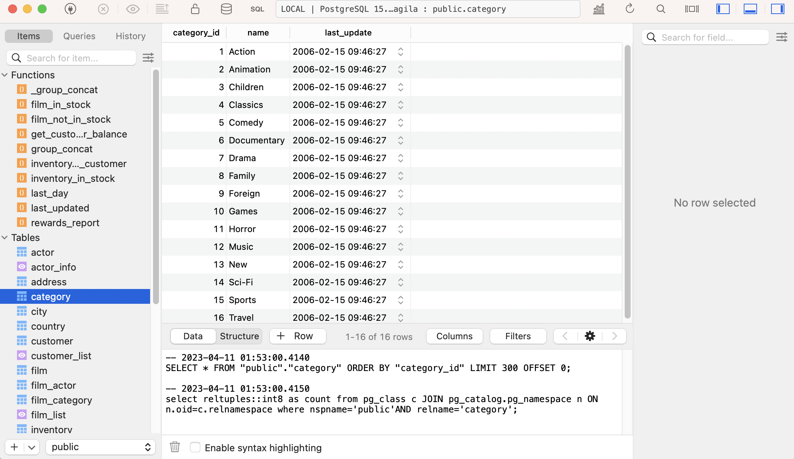
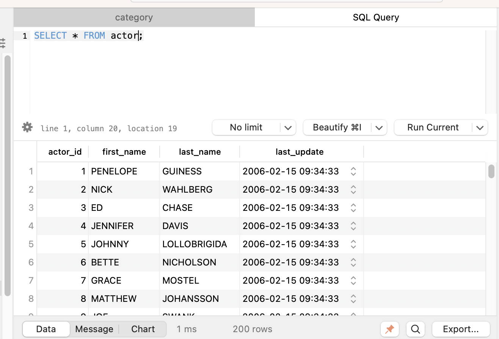

# Set Up

### Create the Database
1. Clone down the [Pagila](https://github.com/The-Marcy-Lab-School/pagila-database) repository and follow the instructions in its `README.md` to create and set up your database.
2. At this point, you can complete the entire assignment by running SQL queries in `psql`. However, for a GUI, follow the instructions below.  

### Table Plus Set Up
1. Open up TablePlus and click "Create a new connection" 
2. Select Postgres from the subsequent menu.
3. You should know see another pop up box asking for credentials. 
  - If you are on windows, add the new user and password you created during your [Postgres setup](https://github.com/The-Marcy-Lab-School/postgres-setup) and click test.
  - If you are on a mac, fill in the user as `postgres` and click test.
4. You should see all the fields light up green. If you do, go ahead and click connect. 
5. After clicking connect, click on the Database icon on the top row. 
6. Select the pagila database and click Open. 
7. You'll see all the database tables on the left-hand side. Clicking on a table will pull up it's data. 
8. To manually run queries, click the SQL icon. 
9. From there, you can type and run queries. To ensure that everything works properly, run the query `SELECT * FROM actor;`. You should be able to see the result below. 

**Note:** If the above query resulted in an error, try prefixing your table names with `public.` in order to run successful SQL queries. For example, `SELECT * FROM public.actor;`. 