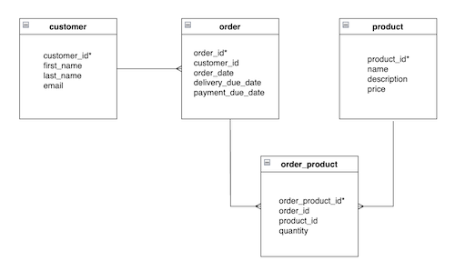

# SQL Challenge
Write your answers to the questions below. Also, include the SQL queries that you used to obtain your answer.

## Part 1: SQL Queries

1. What total # of films have a rental rate of $0.99?
```
#1 Answer:
SQL Query: 
```
2. What is the breakdown of all films by rating? (Format this answer as a [table](https://github.com/adam-p/markdown-here/wiki/Markdown-Cheatsheet#tables))
```
#2 Answer:
SQL Query: 
```
3. Which actor appeared in the most films?
```
#3 Answer:
SQL Query: 
```
4. Which customer has the most movie rentals?
```
#4 Answer:
SQL Query: 
```
5. What was the longest rental period? (Hint: See `rental.rental_date` and `rental.return_date`)
```
#5 Answer:
SQL Query: 
```

## Part 2: ERD Diagram
Create an Entity Relationship Diagram using [draw.io](https://draw.io). Include at least the following tables in your diagram and their relationships to each other.
* film
* actor
* category
* language

You must include all column names, but you do not have to list the data types next to your attributes (columns). You should place an asterisks next to the primary key of the entity. See an example below:



> Note: There are some Many-to-Many relationships in here. Be sure to include the junction tables that link these relationships. For example, there is a M:M relationship between `film` and `actor`. This relationship is linked by the `film_actor` table. Be sure to include that in your ERD as well. 

6. [Link to your ERD should go here]

## Part 3: Advanced Queries

7. What is the address of the store with the most films in their inventory?
```
#7 Answer:
SQL Query: 
```
8. Which category has the most films? How many films are in that category?
```
#8 Answer:
SQL Query: 
```
9. What is the address of the customer "Margaret Moore"? (Just the street address. Not the district, city, and ZIP code)
```
#9 Answer:
SQL Query: 
```
10. There is a customer with the email "CARMEN.OWENS@sakilacustomer.org". What is the name of the city that they live in?
```
#10 Answer:
SQL Query: 
```
11. What country is Store #2 (`store_id = 2`) located in?
```
#11 Answer:
SQL Query: 
```
12. What is the total replacement cost of each store's entire inventory? (**Hint**: Each store has multiple copies of many films that each have a replacement cost.)
```
#12 Answer:
SQL Query: 
```


